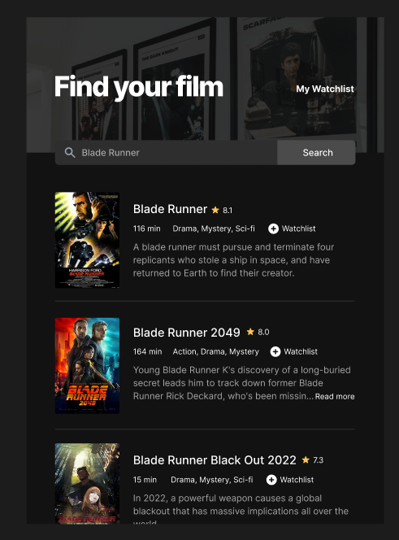
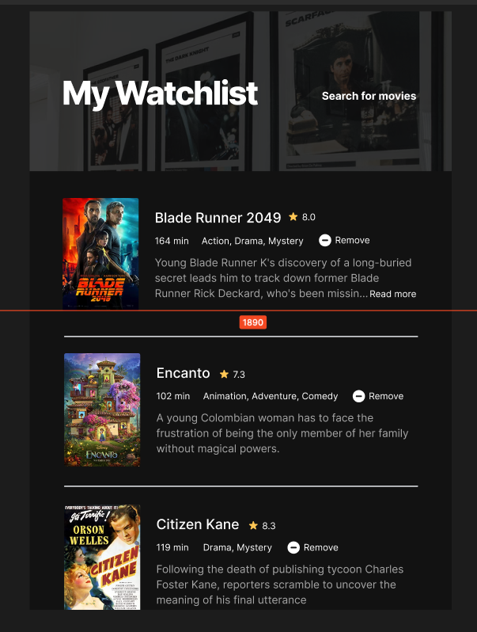

# movie_watchlist
Another solo project from Scrimba -- involving CSS and API

Here is the screenshot of the visual prototype:

Key learning points:

Nevigate from one page to another 

At the moment, I used anchor tags to  switch betwen two pages, but I'm
not so sure if this machanism will work when it's hosted. I'm aware of the use of 
"window.locaton.href" method. That's another option if the current method doesn't work
when it's deployed. 

Using localStorage and rendering the stored data

Saving data on one page and retrieving them on another proved to be a bit tricky. I used
conditonals to detact if a second page is present, if yes, the data are retrieved and rendered 
to the second page. There are quite a few actions for showing and hiding some messages. I struggled
a bit to figure out the logics of arraning various messages properly, partly because they appeared 
in two seperate pages. 

Layout with CSS

I spent lots of time trying to imitate the prototyp images on Figma. Figma made my life a lot easier by
showing all the fonts, colors, margins and paddings required. Obviously, my job was not as simple as
merely doing a lot of tedious copy and paste actions.  The realy challengs lie in using Flex box to build
the layout and align and group various small elements together. 

Most challenging bit:

The hardest part of this project for me was to set up an eventListener to remove an individual movie among 
a list retrieved from the localStorage.  Initially, I used forEach method to warp each button with an click
eventListener, it involved too many DOM nodes, hard to implement, I changed the idea and used event delegation
to simpligy things a lot.  It also took me quite a while to figure out where (or when) to place the eventListener
among a couple of conditionals:
After the page (WatchList page) has finished loading, the retrieval of the chosen movies has completed and the 
"remove" buttons have been dynamically generated and added to the DOM, only at this moment, the eventListener 
can be attached to the buttons.  

